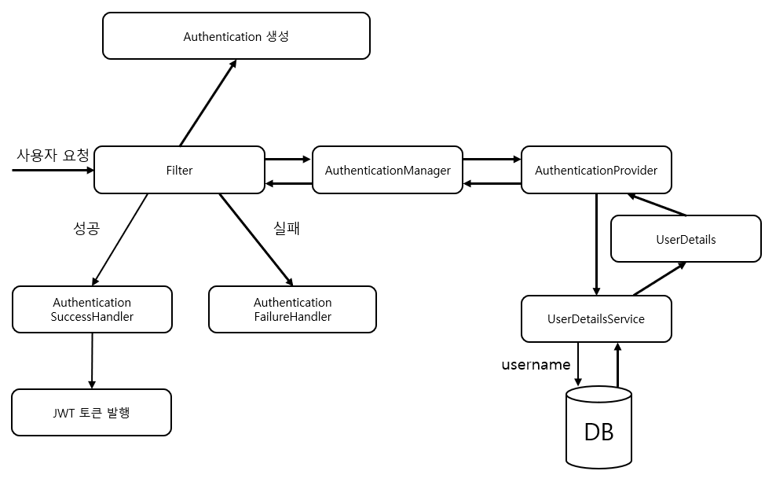
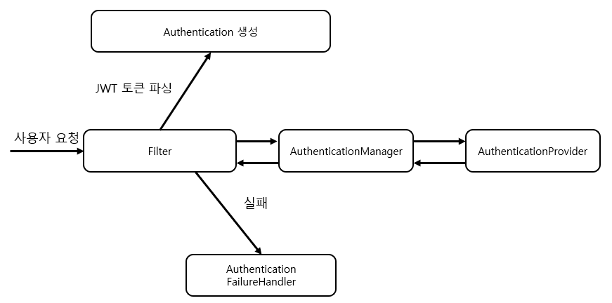

# 스프링 시큐리티와 JWT 연동 연습

# Gradle 의존성 추가
```gradle
dependencies {
    implementation group:'org.springframework.boot', name: 'spring-boot-starter-web'
    compileOnly group:'org.projectlombok', name: 'lombok'
    annotationProcessor group:'org.projectlombok', name: 'lombok'
    implementation group: 'org.springframework.boot', name: 'spring-boot-starter-security'
    implementation group: 'org.springframework.boot', name: 'spring-boot-starter-data-jpa'
    implementation group: 'com.h2database', name: 'h2'
    implementation group: 'io.jsonwebtoken', name: 'jjwt', version: '0.6.0'
}
```
# 개요
대충 흐름을 그려보았는데 아래와 같은 그림이 될 것 같다.

## 로그인 시


## 로그인 인증 시
